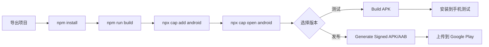
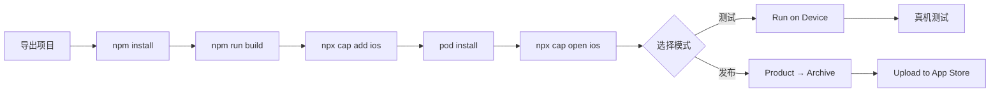

# ria - 原生应用打包完全指南

<div align="center">


**将你的 ria Web 应用打包成真正的原生 Android 和 iOS 应用**

[快速开始](#-快速开始) • [文档](#-文档索引) • [工具](#-工具和资源) • [帮助](#-需要帮助)

</div>

---

## 📱 关于 ria

ria 是一款极简的碎片化想法收集器，采用 Notion 风格设计。现在你可以将它打包成：

- 🤖 **Android 应用** - APK/AAB 格式，可上架 Google Play
- 🍎 **iOS 应用** - IPA 格式，可上架 App Store
- 💻 **完全离线** - 原生应用支持完整的离线功能
- ⚡ **原生性能** - 比 PWA 更快、更流畅

---

## 🚀 快速开始

### 3 分钟上手

```bash
# 1️⃣ 导出项目到本地（见 EXPORT_GUIDE.md）

# 2️⃣ 安装依赖
npm install

# 3️⃣ 构建 Web 应用
npm run build

# 4️⃣ 添加原生平台
npx cap add android    # Android
npx cap add ios        # iOS (仅 macOS)

# 5️⃣ 打开原生项目
npx cap open android   # Android Studio
npx cap open ios       # Xcode
```

**详细步骤请查看：** [NATIVE_APP_GUIDE.md](./NATIVE_APP_GUIDE.md)

---

## 📚 文档索引

### 🎯 按流程阅读

| 步骤 | 文档 | 说明 |
|------|------|------|
| **1** | [EXPORT_GUIDE.md](./EXPORT_GUIDE.md) | 📦 **如何从 Figma Make 导出项目** |
| **2** | [NATIVE_APP_GUIDE.md](./NATIVE_APP_GUIDE.md) | ⚡ **快速开始指南（5 步搞定）** |
| **3** | [CAPACITOR_SETUP.md](./CAPACITOR_SETUP.md) | 🔧 **详细的技术配置文档** |

### 🎨 设计资源

| 工具 | 位置 | 用途 |
|------|------|------|
| 📱 图标生成器 | [/resources/icon-generator.html](./resources/icon-generator.html) | 生成所有尺寸的应用图标 |
| 🚀 启动屏生成器 | [/resources/splash-generator.html](./resources/splash-generator.html) | 生成启动屏幕 |

---

## 🛠️ 工具和资源

### 必备软件

#### Android 开发
- ✅ [Android Studio](https://developer.android.com/studio) - 免费
- ✅ [Java JDK 17+](https://www.oracle.com/java/technologies/downloads/)

#### iOS 开发（仅 macOS）
- ✅ [Xcode 15+](https://developer.apple.com/xcode/) - 免费，从 App Store 下载
- ✅ [CocoaPods](https://cocoapods.org/) - `sudo gem install cocoapods`

#### 通用
- ✅ [Node.js 18+](https://nodejs.org/) - 推荐 LTS 版本
- ✅ [Git](https://git-scm.com/)

### 开发者账号

| 平台 | 费用 | 用途 |
|------|------|------|
| Google Play Console | $25（一次性） | 上架 Android 应用 |
| Apple Developer Program | $99/年 | 上架 iOS 应用、TestFlight |

> 💡 **提示**: 开发和测试不需要付费账号，只有上架应用商店时才需要。

---

## 📦 打包流程概览

### Android 打包流程



### iOS 打包流程



---

## 🎨 应用定制

### 修改应用基本信息

**应用 ID** - 编辑 `capacitor.config.ts`:
```typescript
appId: 'com.yourcompany.ria'  // 改成你的
```

**应用名称** - 编辑对应平台的配置:
- Android: `android/app/src/main/res/values/strings.xml`
- iOS: Xcode → General → Display Name

**版本号** - 在三个地方同步更新:
- `package.json`: `"version": "1.0.0"`
- Android: `android/app/build.gradle`
- iOS: Xcode 项目设置

### 自定义图标和启动屏

1. 打开 `/resources/icon-generator.html` 生成图标
2. 打开 `/resources/splash-generator.html` 生成启动屏
3. 将文件放置到对应目录（工具中有说明）

---

## 📱 应用商店发布

### Android - Google Play

1. 创建 [Google Play 开发者账号](https://play.google.com/console) - $25
2. 在 Android Studio 中生成签名的 AAB
3. 在 Play Console 创建应用并上传 AAB
4. 填写商店信息（描述、截图、分类等）
5. 提交审核（通常 1-3 天）

### iOS - App Store

1. 注册 [Apple Developer](https://developer.apple.com) - $99/年
2. 在 Xcode 中 Archive 并上传
3. 在 [App Store Connect](https://appstoreconnect.apple.com) 创建应用
4. 填写应用信息和截图
5. 提交审核（通常 1-7 天）

---

## 🔄 更新应用流程

```bash
# 1. 修改代码
# 在 Figma Make 或本地编辑器中修改

# 2. 更新版本号
# package.json, build.gradle, Xcode 项目

# 3. 重新构建
npm run build
npx cap sync

# 4. 打包新版本
# Android Studio: Build → Generate Signed APK/AAB
# Xcode: Product → Archive

# 5. 上传到应用商店
# 等待审核通过
```

---

## 📊 应用截图建议

### 推荐内容

1. **主界面** - 快速输入页面
2. **笔记列表** - 时间轴展示
3. **标签管理** - 标签分类功能
4. **数据统计** - 记录习惯可视化
5. **随机回顾** - 独特功能展示

### 截图尺寸

**Android:**
- 手机: 1080 x 1920 (推荐)
- 平板: 1800 x 2560 (可选)

**iOS:**
- iPhone 6.5": 1284 x 2778 (必需)
- iPhone 5.5": 1242 x 2208 (可选)
- iPad Pro: 2048 x 2732 (如果支持)

---

## 🐛 故障排除

### 常见问题速查

| 问题 | 解决方案 |
|------|----------|
| `npm install` 失败 | 删除 `node_modules` 和 `package-lock.json`，重新安装 |
| Android SDK 找不到 | Android Studio → SDK Manager → 安装 SDK |
| iOS 签名错误 | Xcode → Preferences → Accounts → 添加 Apple ID |
| 应用无法联网 | 检查权限配置（AndroidManifest.xml / Info.plist） |
| Capacitor 命令找不到 | `npm install -g @capacitor/cli` |
| 构建失败 | `npx cap doctor` 检查配置 |

**详细解决方案**: [CAPACITOR_SETUP.md - 故障排除部分](./CAPACITOR_SETUP.md#🐛-常见问题)

---

## 💡 进阶功能

想要添加更多原生功能？安装 Capacitor 插件：

```bash
# 相机功能
npm install @capacitor/camera
npx cap sync

# 地理定位
npm install @capacitor/geolocation
npx cap sync

# 推送通知
npm install @capacitor/push-notifications
npx cap sync

# 本地通知
npm install @capacitor/local-notifications
npx cap sync

# 应用内购买
npm install @capacitor/in-app-purchase
npx cap sync
```

然后在代码中使用：
```typescript
import { Camera } from '@capacitor/camera';
import { Geolocation } from '@capacitor/geolocation';
```

查看所有插件: [Capacitor Plugins](https://capacitorjs.com/docs/plugins)

---

## 📈 项目配置

### 当前配置

```typescript
// capacitor.config.ts
{
  appId: 'com.ria.app',
  appName: 'ria',
  webDir: 'dist',
  server: {
    androidScheme: 'https'
  },
  plugins: {
    SplashScreen: {
      launchShowDuration: 2000,
      backgroundColor: "#37352F"
    }
  }
}
```

### 构建脚本

```json
// package.json
{
  "scripts": {
    "build": "vite build",
    "cap:sync": "cap sync",
    "cap:build": "npm run build && cap sync",
    "android:build": "npm run build && cap sync android",
    "ios:build": "npm run build && cap sync ios"
  }
}
```

---

## 🎯 预期时间线

| 任务 | 首次 | 后续 |
|------|------|------|
| 导出和配置项目 | 30 分钟 | - |
| 生成图标和启动屏 | 15 分钟 | 5 分钟 |
| Android 首次打包 | 1-2 小时 | 15 分钟 |
| iOS 首次打包 | 2-3 小时 | 20 分钟 |
| 准备商店素材 | 1-2 小时 | 30 分钟 |
| Google Play 审核 | 1-3 天 | 1-3 天 |
| App Store 审核 | 1-7 天 | 1-7 天 |

---

## 📞 需要帮助？

### 官方资源
- 📖 [Capacitor 官方文档](https://capacitorjs.com/docs)
- 💬 [Capacitor Discord 社区](https://discord.gg/UPYYRhtyzp)
- 🐛 [GitHub Issues](https://github.com/ionic-team/capacitor/issues)

### Android 资源
- 📖 [Android 开发者文档](https://developer.android.com/)
- 📖 [Google Play 发布指南](https://developer.android.com/distribute)

### iOS 资源
- 📖 [iOS 开发者文档](https://developer.apple.com/documentation/)
- 📖 [App Store 审核指南](https://developer.apple.com/app-store/review/guidelines/)

---

## ✅ 检查清单

打包前确认：

- [ ] ✅ 已导出项目到本地
- [ ] ✅ 已安装 Node.js 18+
- [ ] ✅ 已安装 Android Studio（如果打包 Android）
- [ ] ✅ 已安装 Xcode（如果打包 iOS，仅 macOS）
- [ ] ✅ 已运行 `npm install`
- [ ] ✅ 已运行 `npm run build` 成功
- [ ] ✅ 已生成应用图标
- [ ] ✅ 已生成启动屏幕
- [ ] ✅ 已修改应用 ID 和名称
- [ ] ✅ 已设置正确的版本号

发布前确认：

- [ ] ✅ 准备好应用截图（3-8 张）
- [ ] ✅ 准备好应用描述（短+长）
- [ ] ✅ 准备好隐私政策链接
- [ ] ✅ 设置好签名密钥（Android）
- [ ] ✅ 配置好开发者证书（iOS）
- [ ] ✅ 注册了开发者账号
- [ ] ✅ 在真机上测试通过

---

## 🎉 开始打包！

**第一次？** 从这里开始：

1. 📖 阅读 [EXPORT_GUIDE.md](./EXPORT_GUIDE.md) - 导出项目
2. ⚡ 阅读 [NATIVE_APP_GUIDE.md](./NATIVE_APP_GUIDE.md) - 快速上手
3. 🎨 使用 [icon-generator.html](./resources/icon-generator.html) - 生成图标
4. 🚀 使用 [splash-generator.html](./resources/splash-generator.html) - 生成启动屏

**准备好了？** 开始打包：

```bash
npm run build
npx cap add android
npx cap open android
```

---

<div align="center">

**🎊 祝你打包顺利！将 ria 带给更多用户！**

Made with ❤️ using Capacitor

</div>
